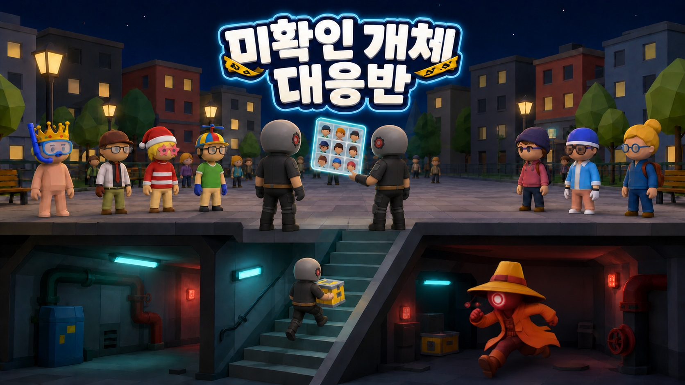
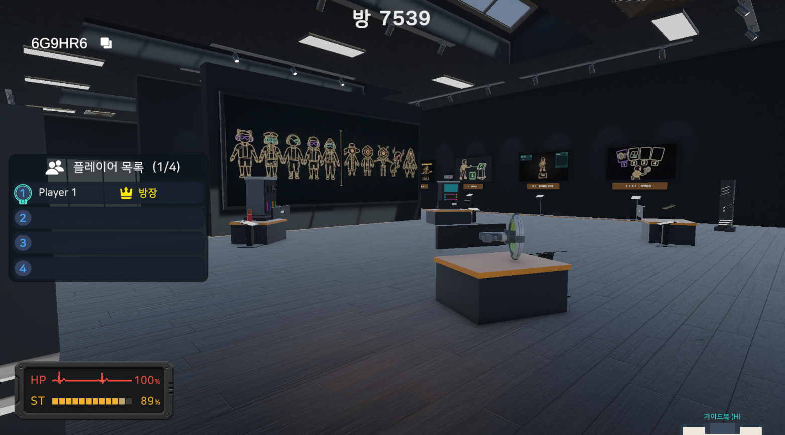
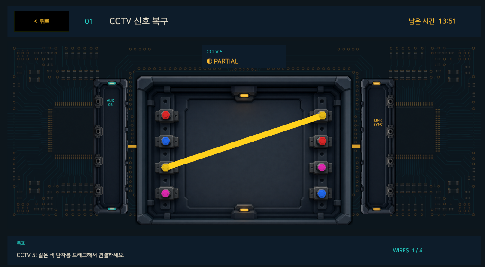
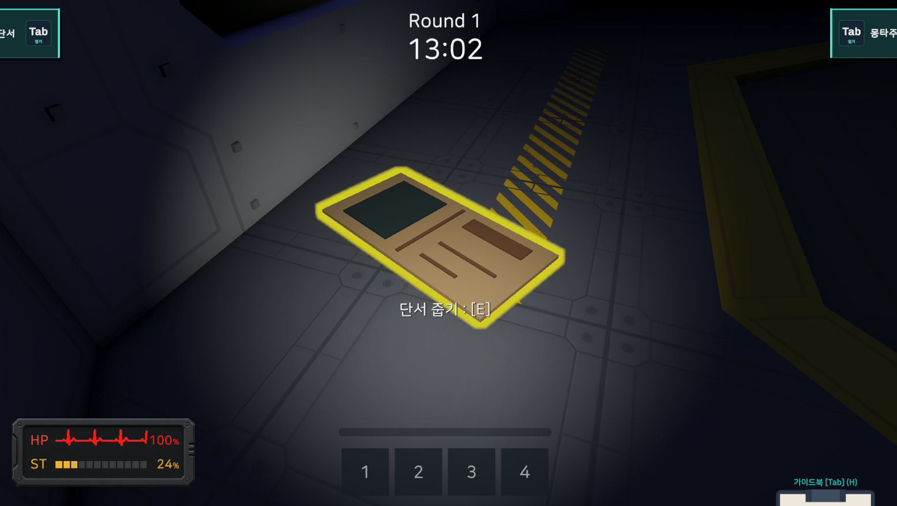
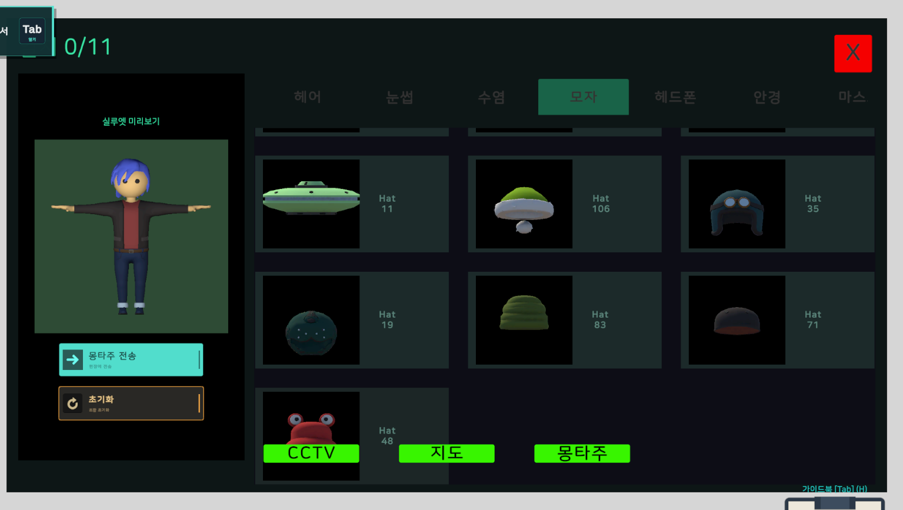
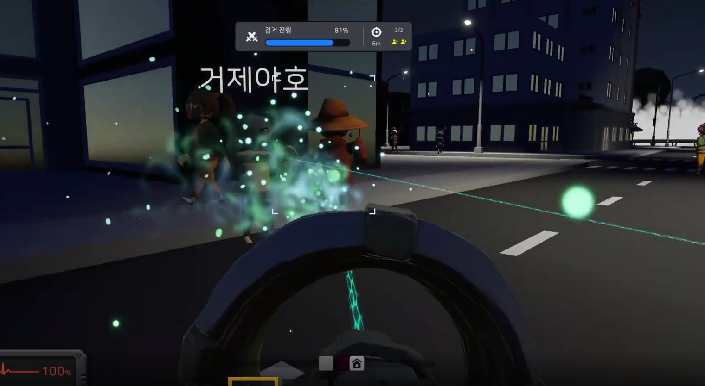
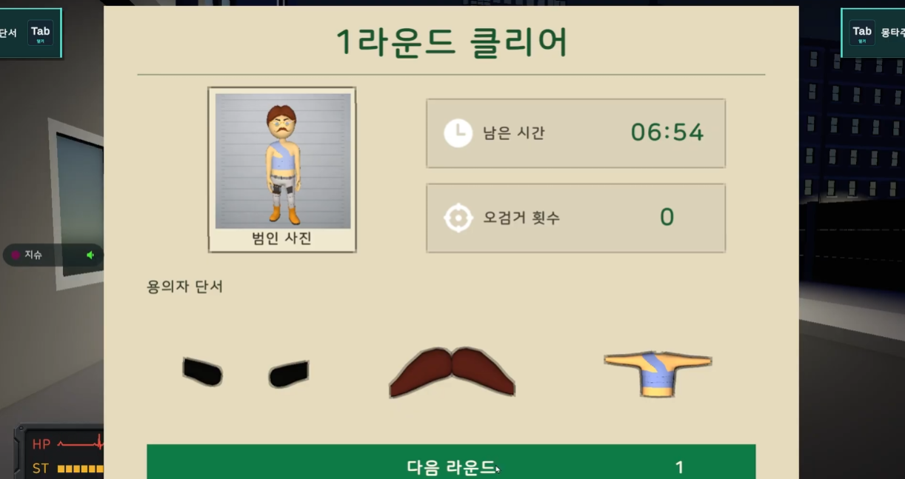

# 미확인 개체 대응반 (Undercover)

> 지하에서 위험을 감수해 단서를 모으고, 지상 군중 속에 위장한 외계인을 찾아내는 4인 협동 추리 게임

<p align="center">
  
</p>

## 게임 소개

**미확인 개체 대응반**은 플레이어들이 함께 단서를 수집하고, 군중 속에 숨어든 외계인을 찾아 검거하는 협동 추리 게임입니다.

플레이어는 지상과 지하를 오가며 서로 다른 정보를 모읍니다. 지상에서는 군중을 관찰하고 조사 미션을 수행하며, 지하에서는 외계인의 위협을 피해 결정적인 단서를 확보합니다. 제한된 정보만으로 바로 정답을 맞히기보다, 팀원들과 단서를 맞춰가며 후보를 좁히는 과정이 핵심입니다.

## 핵심 재미

- **위험을 감수하는 단서 수집**  
  중요한 단서는 지하에서만 얻을 수 있습니다. 더 깊이 들어갈수록 정답에 가까워지지만, 외계인의 위협도 커집니다.

- **군중 속 위장 외계인 찾기**  
  비슷한 외형의 NPC들 사이에서 단서와 몽타주를 바탕으로 진짜 외계인을 찾아야 합니다.

- **팀원과 함께 내리는 검거 판단**  
  단서를 더 모을지, 지금 후보를 확정할지 계속 판단해야 합니다. 검거는 혼자 끝낼 수 없고, 팀원과 협력해야 성공합니다.

## 플레이 흐름

### 1. 대기실과 튜토리얼



플레이어는 대기실에서 접속하고 닉네임을 설정한 뒤, 기본 조작과 상호작용을 익힙니다. 모든 플레이어가 준비를 마치면 라운드가 시작됩니다.

### 2. 지상 조사



지상에서는 군중을 관찰하고 조사 미션을 수행합니다. CCTV 수리, 배전반 수리 같은 미션을 완료하면 관제 정보나 조명 등 수색에 도움이 되는 요소가 활성화됩니다.

### 3. 지하 잠입



지하에서는 외계인을 피해 단서를 수집합니다. 지하는 위험하지만, 외계인의 정체를 좁히는 핵심 정보가 숨겨진 공간입니다.

### 4. 단서 취합



수집한 단서는 HQ 콘솔에서 몽타주로 조합됩니다. 플레이어들은 지하에서 얻은 단서와 지상에서 확인한 정보를 대조하며 후보를 좁혀갑니다.

### 5. 외계인 검거



의심 NPC가 진짜 외계인으로 확인되면 위장이 해제되고 추격이 시작됩니다. 플레이어 2명이 함께 제압해야 검거가 완료됩니다.

### 6. 라운드 결과



검거에 성공하면 라운드가 클리어되고, 실패하면 다시 단서와 판단을 점검해야 합니다.

## 주요 콘텐츠

- 최대 4인 협동 멀티플레이
- 지상과 지하를 오가는 2단 플레이 구조
- CCTV 수리, 배전반 수리 등 조사 미션
- 단서를 기반으로 한 몽타주 조합
- 군중 속 위장 외계인 식별
- 외계인 추격과 2인 협동 검거
- 매 라운드 달라지는 지하 맵과 NPC 외형

## 프로젝트 정보

| 항목 | 내용 |
| --- | --- |
| 장르 | 협동 추리 게임 |
| 플레이 인원 | 최대 4인 |
| 플랫폼 | PC |
| 엔진 | Unity |
| 개발 기간 | 2026.07.09 - 2026.08.29 |
| 팀 | 경일특공대 5팀 |

## 시작하기

### 요구 사항

- Unity Hub
- Unity Editor `6000.3.15f1`
- Git

### 실행 방법

```bash
git clone https://github.com/yoonjisu1201/undercover-project-team5.git
```

1. Unity Hub에서 프로젝트 폴더를 추가합니다.
2. Unity Editor `6000.3.15f1`로 프로젝트를 엽니다.
3. 최초 실행 시 패키지 임포트와 라이브러리 빌드가 끝날 때까지 기다립니다.
4. Unity에서 메인 씬을 열고 플레이를 시작합니다.

## 팀원

**경일특공대 5팀**

- 윤지수
- 남현우
- 박우빈
- 정호종


